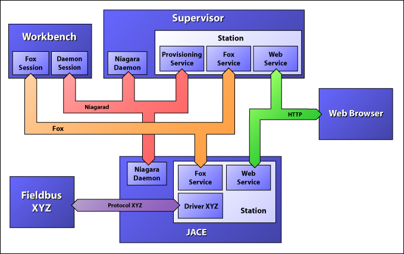

#结构
##概述
本章介绍Niagara结构中的关键概念和专业术语
###程序（*Programs*）
一个Niagara系统中有四种典型的Programs，这些程序间的关系及其网络通讯关系可通过下面的通讯图表解释：

* **站点（*Station*）**：是Niagara运行时实例，意即在JavaVM上运行起来的的Niagara组件应用实例。
* **工作台（*Workbench*）**：是一种Niagara工具，意即在JavaVM上运行的，承载Niagara插件的主机。
* **守护进程（*Daemon*）**：是本地的一个守护进程，Daemon用来引导启动Station并且管理运行平台的各种配置，比如本地系统的IP配置。
* **浏览器 （*Web Browser*）**：是标准的浏览器客户端，用比如IE或FireFox等浏览器来承载一个Niagara的网页用户界面。
 
###通讯协议（*Protocols*）
这里有3种的通讯协议用来将上述4种程序结合起来：
* **Fox**：是一种私有专利的TCP/IP上运行的协议，用来实现*Station*与*Station*间通讯，也可用来实现*Workbench*与*Station*间的通讯。
* **HTTP**：标准协议，用来在网页浏览器和Station的网页间通讯。
* **Niagarad**：是一种私有专利的通讯协议，用来实现守护进程和Workbench间的通讯。
###平台（*Platforms*）
Niagara可以被很多平台承载，从小的嵌入式控制器到高端服务器都可以。
* **Jace**：术语*Jace*是（Java Application Control Engine “Java程序控制引擎”）的缩写，它用来描述一种无显示器的嵌入式平台。通常一个Jace都运行于Falsh（闪存）文件系统并且提供后备电池组。Jace 通常承载一个Daemon和一个*Station*，不承载Workbench。Jace通常运行QNX（一种商用的实时操作系统）或WindowsXP嵌入版作为它的操作系统。
* **Supervisor**：术语Supervisor适用于运行了一个Station的工作站或服务器。Supervisor特指为其他无历史或警报集合的Station提供服务的Station机器。Supervisor必须运行一个Station，但也可能同时运行Workbench或Daemon。 
* **Client**：客户端一般都是运行Windows或Linux操作系统，并使用Workbench或浏览器来访问Niagara系统的。
##站点（*Stations*）
Niagara系统的架构是围绕着“以组件（*Component*）为导向的编程”为核心设计的。组件（*Component*）是使用Java编写、打包、部署为模块（*modules*）的自包含单位，多个组件（*Component*）通过连线连接构成一个应用（*application*）并运行于*Station*的运行时上。

一个Niagara的Station应用，会被存储在名为config.bog的XML文件中，这个config.bog文件包含了一个包括组件及其属性配置的树状结构中，并且记录了它们之间如何使用连接（*link*）来连通彼此的。Station的数据库可使用如下机制中的一种创建：
* 使用Workbench的图形编程工具在Station在线时即时编辑。
* 使用Workbench的图形编程工具离线编辑。
* 预定义并在站点创建时安装。
* 本地程序自动生成，可能会出现在学习操作中。 

一个限制了步骤的用于实现专用的任务的*Station*通常称为应用(*appliance*)

术语Supervisor或Jace可用来替换Station，严格说来，术语Station描述的是在所有平台上共有的组件（*Component*）运行时环境，而Supervisor和Jace描述的是具体的主机平台。

##守护进程（*Daemon*）
Niagara的守护进程使用本地代码写成，没使用Java。在操作系统上由守护进程来引导并管理Niagara平台，具体功能如下：
* 安装并备份站点数据库。
* 启动并监视站点。
* 配置Tcp/IP设置。
* 安装并升级操作系统（只针对QNX）。
* 安装并升级JavaVM。
* 安装并升级Niagara软件。
* 安装本地字典 
* 管理并安装授权码（*licenses*）
在Windows操作系统平台中，Daemon是以Windows的后台服务形式运行的。在QNX操作系统平台中，Daemon是以一个守护进程的运行方式在QNX启动时启动的。

使用*Workbench*界面访问Daemon是最常用的做法，必须使用“Open platform”命令来启动一个平台会话用以连接远程客户端的Daemon，在平台会话中成套的视图工具来完成上述几点公所。

另一种连接Daemon的途径是通过运行plat.exe启动一个命令行控制台来进行通讯，用以获得更多的信息。通过在命令行界面中输入合适的脚本，这个控制台能完成上述的大部分功能。
##工作台（Workbench）
工作台是Niagara一个十分强大的工具，工作台是使用bajaui模块里的widget架构搭建的，而bajaui本身又是使用标准的Niagara的组件模式搭建的。

工作台结构是为了给第三方插件厂商提供一个常用的运行环境而设计的，最常用的插件形式是“视图”（*View*）。视图编辑器（*Viewer*）或编辑器（*Editor*）一般以组件（*Component*）或文件（*file*）的形式存在，其他类型的插件还包括工具栏（*sidebars*）和工具（*tools*）

工作台可通过`BWbProfile`类的API来改变自身，BWbProfile允许开发者重用Workbench的基础组件，用来创建、添加、删除自定义的菜单、工具按钮、工具栏、和视图等应用。
Web UI （网页界面）
对Niagara来说，一个重要的功能是通过网页浏览器给用户提供一个界面，Niagara同时提供网页界面的服务器端和客户端。

在服务器端，WebService组件负责在Station运行中提供HTTP和HTTPS服务，WebService通过BWebServlet子类提供一个标准的Servlet引擎。其他一些附加的类和API如BServletView等在，BWebServlet基础上提供更高层抽象的一些功能。

Niagara提供了两种客户端技术。第一种是web Workbench，这种方式允许Workbench运行在有Java插件的浏览器上，web Workbench需要下载小的applet模块（叫做wbapplet）来在客户端计算机上运行起web Workbench界面，这些wbapplet会被浏览器缓存在本地硬盘。

第二种客户端技术叫“hx”，hx架构使用Serverlet作为服务器端，JavaScript作为它的客户端，hx使得客户无需安装java插件即可获得实时界面，它只需要使用HTML、CSS、JavaScript等标准的网络技术。
##FOX通讯协议
Nagara拥有自有协议的通讯协议fox，fox协议在Station间通讯和Workbench与Station键通讯一样好。Fox是一种基于TCP协议的多通道复用点对点通讯协议。Fox通讯的默认端口号是1911，它的特性包括：
* 基于Tcp的Socket通讯。
* 摘要式验证方式（用户名/密码 都被加密）。
* 点对点通讯方式。
* 请求/答复 运行方式。
* 支持异步事件。
* 基于流（Streaming）模式。
* 通过频道切换多路复用技术可实现多应用同时运行。
* 使用字符明码发送帧或信息，方便调试。
* 统一的信息语法格式。
* 高性能。
* 使用Java实现的协议栈。
 
##接口软件栈（API Stack）
Niagara提供广泛的成套的Java API 用来自定义扩展Station和Workbench。下图描述了各种软件是如何构成Niagara架构的：

* **Baja**：Niagara架构的基础，通过Baja模块定义API，这些API定义了基础规则，包括：模块（modules）、组件模块（Component modules）、命名（naming）、导航（navigation）以及安全（security）等。
* **混合结构（*Horizontal*）**：Niagara包含了许多预先建好的组件库，用来支持物联网等领域，这些模块提供了基本的功能，包括：控制（control）、报警（alarm）、历史记录（historical）、日程安排（scheduling）及BQL等功能。
* **驱动（*Drivers*）**:Niagara被设计为全面支持多协议混用。在Niagara中，使用driver framework标准建立的，用来和外部设备或系统同步信息的组件我们称之为drivers。Drivers将系统中所有的总线如BACnet或Lonworks整合为一体称为一个商业系统，就类似关系型数据库与网络服务一样的关系。
* **人机界面(*Human Interface*)**:Niagara提供了广泛的用户界面协议栈。“gx”架构提供了底层的图像API。在gx基础上建成的bajaui模块提供了专业的工具及标准widgets。在bajaui基础建立的Workbench架构提供了插件的标准API。Px架构和工具用来通过XML实现图形化建立用户界面。
 
